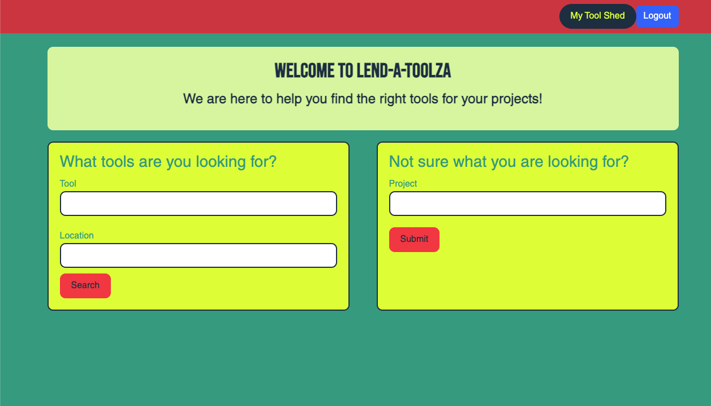
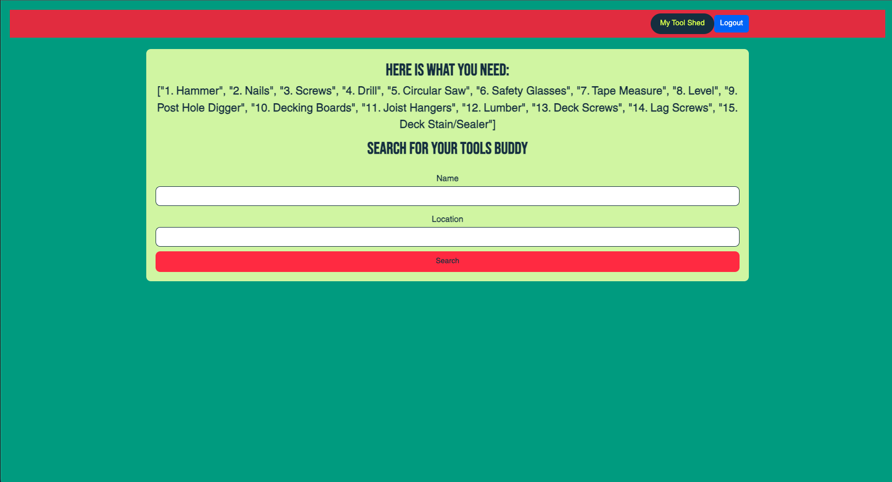
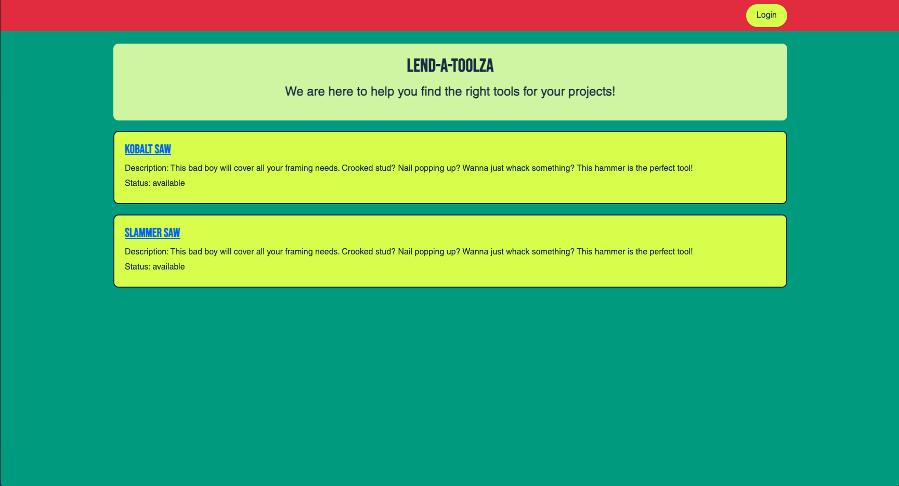
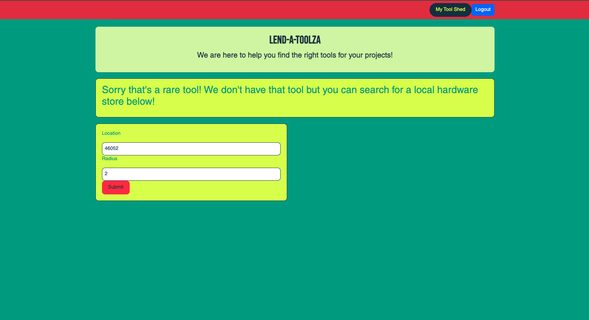
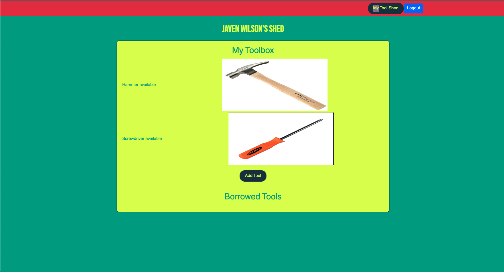
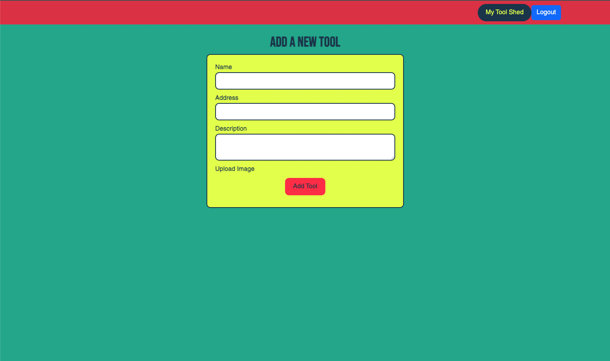

[](https://github.com/NickTassinari/lend-a-toolza-fe/graphs/contributors)
[](https://github.com/NickTassinari/lend-a-toolza-fe/forks)
[](https://github.com/NickTassinari/lend-a-toolza-fe/stargazers)
[](https://github.com/NickTassinari/lend-a-toolza-fe/issues)

# Lend-A-Toolza


## About This Project
### Important to Note
This is an SOA app and needs both this repo (front end) AND [ ](https://github.com/sicknacco/lend-a-toolza-be) (back end) in order to be fully functioning.

### Mod 3 Group Consultancy Project
Lend-A-Toolza is a crowdsourced tool lending library web application. Designed for folks looking to borrow a particular tool within any given area/location. Lend-A-Toolza has the ability for registered users to upload their lendable tool with a picture, a description of the tool and a borrowing period as well as choose to borrow from a list of available tools in their area.
                                                  <br><br>
                    
                    

## Built With
* 
* 
* 
* 
* 
* 
* 
* 

## Running On
  - Rails 7.0.6
  - Ruby 3.2.2

## <b>Getting Started</b>

To get a local copy, follow these simple instructions

### <b>Installation</b>

1. Fork the Project
2. Clone the repo 
``` 
git clone git@github.com:NickTassinari/lend-a-toolza-fe.git
```
3. Install the gems
```
bundle install
```
4. Create the database
```
rails db:{create,migrate}
```
5. Add Figaro
```
bundle exec figaro install
```
6. Add environment variables to application.yml file
  - Navigate to the application.yml file in the config directory
  - Add the following to the file
``` 
#application.yml
GOOGLE_CLIENT_ID: 
GOOGLE_CLIENT_SECRET:
AWS_ACCESS_KEY: 
AWS_SECRET_ACCESS_KEY: 
BUCKET_NAME: 
AWS_REGION: 
```
7. Get your API key at: https://code.google.com/apis/console/ Note the Client ID and the Client Secret.
```
- For more details, read the Google docs: https://developers.google.com/accounts/docs/OAuth2
    - Put your Client ID after `GOOGLE_CLIENT_ID:`
    - PUT you CLIENT SECRET after `GOOGLE_CLIENT_SECRET:`
- Create your AWS S3 bucket with these instructions: https://docs.aws.amazon.com/AmazonS3/latest/userguide/creating-bucket.html
  - Put the relavent information into the application.yml file for `AWS_ACCESS_KEY: AWS_SECRET_ACCESS_KEY: BUCKET_NAME: AWS_REGION:` 
```
8. Run Tests in the terminal to verify everything was set up correctly
```
#terminal
bundle exec rspec
```
- All tests should be passing
8. Run Rails Server from the terminal to verify page is loading
```
#terminal
rails s
```
- Open a web browser and navigate to `http://localhost:5000`
- The welcome page should display
- Note: To be able to have full functionality of the site you will also need to setup the backend repo, setup instructions can be found here: [lend-a-toolza](https://github.com/NickTassinari/lend-a-toolza-fe)
```

### <b>Contribute your own code</b>
1. Create your Feature Branch 
```
#terminal
git checkout -b feature/AmazingFeature
```
2. Commit your Changes 
```
#terminal
git commit -m 'Add some AmazingFeature' 
```
3. Push to the Branch 
```
#terminal
git push origin feature/AmazingFeature
```
4. Open a Pull Request
```

## How To Use Lend-A-Toolza
 Login with the Login Button and Sign in with Google
 
 Not sure what tools you need for your project? Ask our OpenAI for a suggestion of tools to use
 
 This page lists potential tools for your project and allows you to search for tools in your area
 
 Search results from your area and request to borrow 
 
 If we don't have the tool you're looking for you can search for a hardware store in your area that might
 
 Here is the results for the store search
 
Click on My Tool Shed and you will be brought to your dashboard where you can see the tools you own, tools you have borrowed and the ability to add a tool

This is the add tool form



## Schema
```
    t.string "name"
    t.string "email"
    t.string "token"
    t.string "google_id"
    t.string "location"
    t.datetime "created_at", null: false
    t.datetime "updated_at", null: false
```

## Contributing  [](https://github.com/NickTassinari/lend-a-toolza-fe/issues)
Contributions are what make the open source community such an amazing place to learn, inspire, and create. Any contributions you make are **greatly appreciated**.

If you have a suggestion that would make this better, please fork the repo and create a pull request. You can also simply open an issue with the tag "enhancement".
Don't forget to give the project a star! Thanks again!

## Authors
- Crow Rising [ ](https://github.com/CrowRising) [ ](https://www.linkedin.com/in/crowrising/)
- Nick Sacco [ ](https://github.com/sicknacco) [ ](https://www.linkedin.com/in/nick-sacco/)
- Nick Tassinari [ ](https://github.com/NickTassinari) [ ](https://www.linkedin.com/in/tassinarinicholas/)
- Javen Wilson [ ](https://github.com/javenb022) [ ](https://www.linkedin.com/in/javen-wilson/)

## Planning Tools
- [](https://miro.com/app/board/uXjVMz1L4ow=/#tpicker-content)
- [ ](https://github.com/users/CrowRising/projects/6)